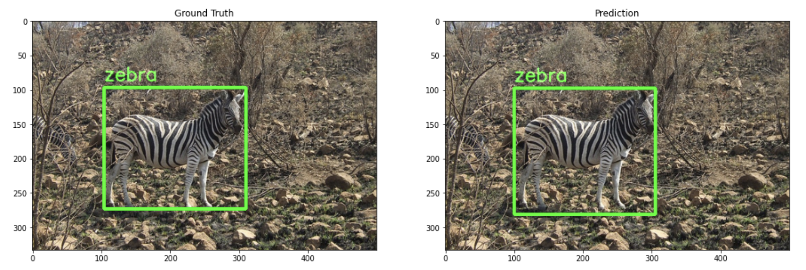
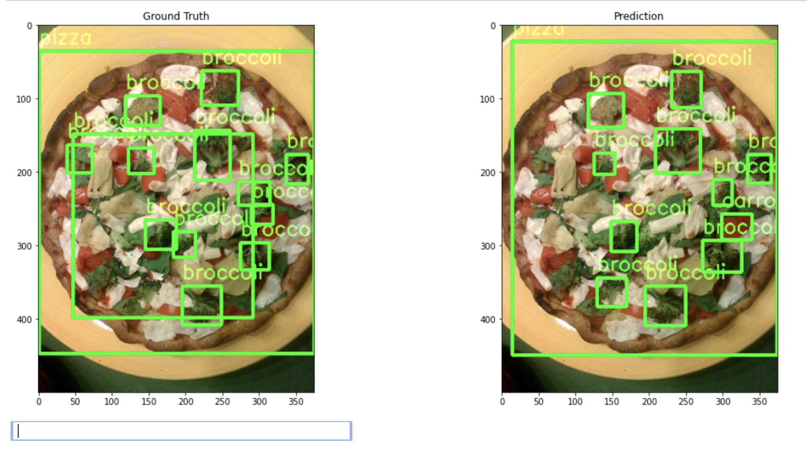
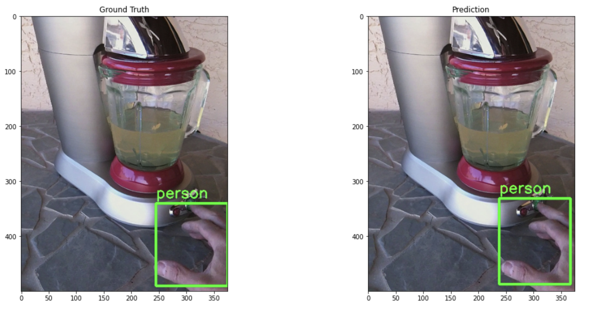
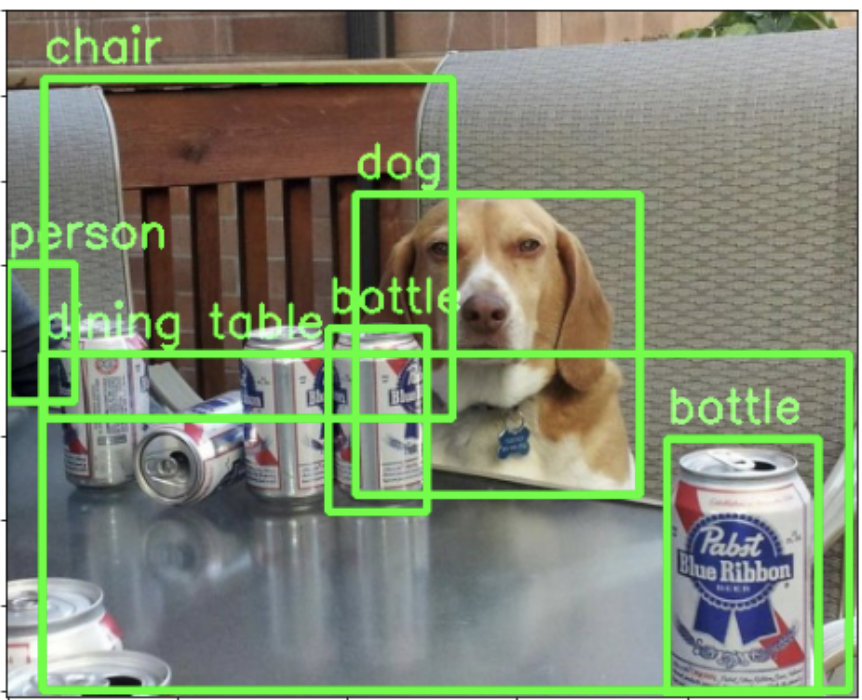
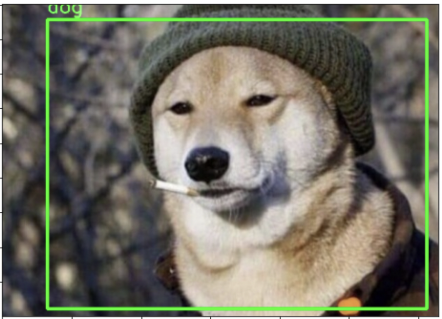
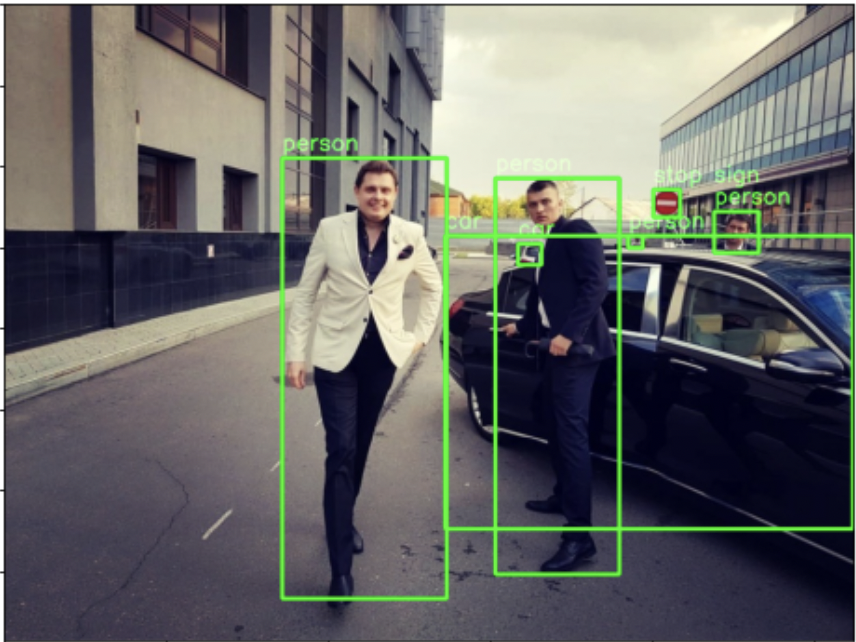

# Detection model

Здесь представлен код для обучения и инфера модели детекции. Модель обучена на датасете COCO и детектирует 80 классов.

## Структура данных
```
data
├── annotations
    ├── train.json
    ├── val.json
├── images
    ├── img_1.jpg
    ├── img2.jpg
    ...
```
## Пример запуска обучения
```
python3 train.py --images_path path_to_images --annotations_path path_to_annotations
```
### Параметры
- ```--images_path``` - Путь до изображений
- ```--annotations_path``` - Путь до COCO аннотаций
- ```--remove_zeros``` - Сгенерировать новые аннотации, исключив изображения без объектов
- ```--train_batch_size``` - batch size для обучения
- ```--test_batch_size``` - batch size для валидации
- ```--num_classes``` - Кол-во классов
- ```--nms_thresh``` - Порог для Non Maximum Suppression
- ```--num_epochs``` - Кол-во эпох
- ```--path_to_model``` - Путь до весов модели
- ```--model_save_path``` - Путь для сохранения весов
- ```--lr``` - Learning rate
- ```--momentum``` - Momentum
- ```--weight-decay``` - Weight Decay
- ```--print_freq``` - Частота вывода информации


## Пример запуска инференса для одного изображения
```
python3 run.py --image_path path_to_image --annotations_path path_to_annotation --path_to_model path_to_model --image_save_path path_to_save_dir
```
### Параметры
- ```--image_path``` - Путь до изображения
- ```--annotations_path``` - Путь до COCO аннотаций
- ```--num_classes``` - Кол-во классов
- ```--nms_thresh``` - Порог для Non Maximum Suppression
- ```--thresh``` - Порог для детекций
- ```--path_to_model``` - Путь до весов модели
- ```--image_save_path``` - Путь для сохранения детекций и меты

## Метрики
Метрики подсчитывались на валидационной выборке COCO
```
mAP: 0.5986
```

## Примеры







